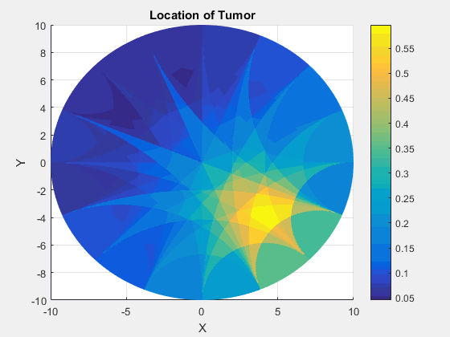
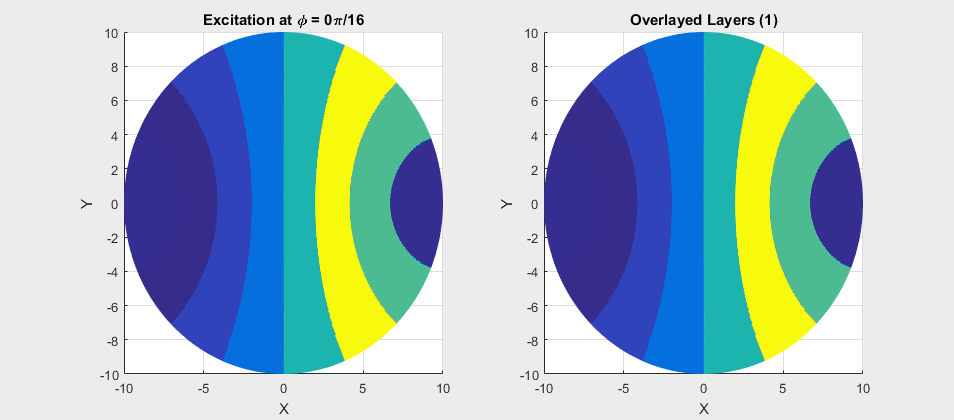
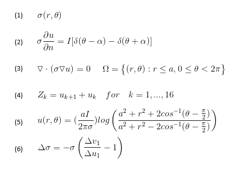

# Applied Math Project -- Application of Green's Functions
This project is to learn an application of Green's Functions towards Electrical Impedance Tomography (EIT) to image a tumour in a circular region using MATLAB. 

**See the resulting EIT layers rendered to produce a 3D gif!**

 

Trouble viewing the GIF? Download the video here: [Video](MATLAB-Output-Images/tumorAnimation.mp4)

---
# Table of Contents
1. [Introduction to Electrical Impedance Tomography](#intro)
2. [Problem Description](#problem-description)
3. [Solution](#solution)
	1. [Solution to the BVP](#bvp)
	2. [Implementation of the Approximation](#implementation)
	3. [Overlaying the Solution](#overlay)
4. [Equations](#equations)

---

## Introduction to Electrical Impedance Tomography

Electrical impedance tomography (EIT) is a method imaging which uses surface measurements to determine variations in electrical conductivity, permittivity, and impedance within an object to image that specific object. It is highly used in medical imaging as it is noninvasive and biological tissues and fluids have considerable variations from each other in conductivity and is therefore distinguishiable using EIT. 

In the regular set-up for an EIT system, surface electrodes are attached to the skin of the object being examined. Current is then applied to node pairs (located such that the examined area separates the two nodes) and the voltage across the nodes is measured such that conductivity can be measured.

---

## Problem Description 
To determine the changes of conductivity (noted by equation [(1)](#equations)) within a circular region from a finaite number of voltage measurements on a boundry, a current I is applied to parts of the boundary. This then becomes a partial differential equation subject to the boundary conditions as seen in equations [(2)](#equations) and [(3)](#equations). This then is a boundary value problem (BVP)

This is called an inverse problem because the material properties are determined from measurements of field quantities and in this case, can lead to identifying anomolies such as turmours which are known to have much higher conductivities than normal tissues. Thus, because of this property of tumours, identifying areas of perturbed conductivities can image the tumour!

### The Data 
The data file is a sequence of "measured data" generated useing a finite element program used to imitate a similar EIT data file. 

- [Z_data.mat](MATLAB-Code/Z_ddata.mat)

Information about the file:
* Conatines 128 = 16 X 8 data points representing the voltage differences from 16 nodes.
* The nodes are uniformly distributed alon ghte boundary of the circle.
* Due to symmetry, there are only 8 indepedent axially distributed nodes simulating the pairs k - k'.
* The first of the 16 is along the x axis, aka the phi angle is 0.
* Z1 is the voltage difference between the stimulating axis T1 and the next terminal marked T2.
* Subsequent elements represent the voltage differences as seen as in equation [(4)](#equations).

---

## Solution 

### Solution to the BVP 
The solution to the BVP noted by equations [(2)](#equations) and [(3)](#equations) is found to be as shown in equation [(5)](#equations). This is found by using Green's functions. 

I don't go over the derivation here, but if you are interesting in learning how to solve this BVP problem or other BVP problems, I would recommend looking at the lectures provided by Dr. Anthony Pierce on Green's Functions [here](https://www.math.ubc.ca/~peirce/math406_17.htm). 

### Implementation of the Approximation
In order to find the conductivity in the material, equation [(6)](#equations) is implemented using voltage measurements (v) from the Z_data.mat file and the (u) calculated from equation [(5)](#equations). 

### Overlaying the Solutions 
From the 8 axially distributed nodes provide 8 different images of the impedance and is summed up and overlayed to present the solution as seen below: 

 

Trouble viewing the GIF? Download the video here: [Video](MATLAB-Output-Images/layers.mp4)

### The Final Solution 
The final solution when overlayed is computed in MATLAB in "project_eit.m".

Download the code here:

- [project_eit.m](MATLAB-Code/project_eit.mat) 

The output of the project is found as the [gif found at the top of the page!](#gif)

---

## Equations 
An image of the equations used are found in the image below:

 

